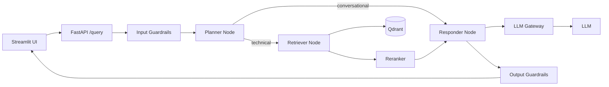

# Enterprise Agentic RAG: Project Overview

## Metadata

| Field | Value |
|---|---|
| Project | Production-grade, scalable, advanced RAG chatbot |
| Use case | Kubernetes technical assistant (public docs as "true data", unrelated docs as "noisy data") |
| Source | 8-hour live marathon, Session 1 (about 8.5h). Part 2 (evals, deployment) pending |
| Mentors | Krish (architecture, security), Dishant (agents, guardrails, gateway), Yash (ingestion, reranking), Paul (deployment, Q&A) |
| Repo | `muhannedalogaidi/8hr-marathon`, one branch per lesson |
| Current branch | `teaching/00-scaffold` (data and docs only, no code) |
| Phases | Phase 1: local, free-tier, "average" components. Phase 2: AWS with CI/CD and stronger components |
| Level | Intermediate Python, FastAPI basics, OOP, Docker basics |

## 1. Goal

Build a RAG chatbot that stays **accurate in a noisy data environment** (about 90% noisy, 10% true data), is **secure**, **observable**, **fault tolerant**, and **scalable**. The finished system must be reliable (fast, low latency), secure (hard to bypass), and scalable (more data, more traffic).

## 2. Why it matters (the enterprise risks it answers)

| Risk | Example | Mitigation in this project |
|---|---|---|
| Untrusted input | Prompt injection, "forget your instructions" | Input guardrails |
| PII leakage | Credit card, phone, API keys sent to an LLM | Custom PII rail |
| Unpredictable output | Hallucination, leaked secrets | Output guardrails, grounded retrieval |
| Provider outage / rate limits | Free tier hits 30 req/min | LLM gateway with fallback |
| Cost waste | Off-topic chats, repeated questions | Topic guard, planner skip, semantic cache |
| No visibility | Cannot see where latency or errors come from | Logfire and LangSmith tracing |
| Compliance | Data privacy laws, AI governance | Audit logs, gateway policies, evals |

## 3. Features

- Smart multi-format ingestion (PDF, HTML, DOCX, PPTX, TXT) into a vector DB
- Agentic flow: planner decides **conversational** vs **technical**, then retrieves only when needed
- Retrieval of 15 candidates, **cross-encoder rerank** to top 5
- Multi-turn conversation memory (thread IDs)
- Input and output guardrails (off-topic, jailbreak, sensitive, greetings, PII, urgency, secret masking)
- LLM gateway: virtual keys, model routing, fallback, load balancing, caching, cost and latency tracking
- Full observability (spans, traces, waterfall)
- Evaluation suite (RAGAS, Part 2)
- Cloud deployment with CI/CD (AWS, Part 2)

## 4. Architecture (request flow)

Ingestion flow: raw files, smart parser, chunker, embedder, Qdrant (cosine similarity).

## 5. Tech stack and why

| Layer | Choice (local phase) | Production swap | Note |
|---|---|---|---|
| Language / env | Python 3.11, `uv` | same | Use exactly 3.11, other versions break dependencies |
| API | FastAPI + Uvicorn | same | Routes: `/`, `/graph`, `/query`, `/docs` |
| UI | Streamlit | same | Calls `/query` with prompt and thread ID |
| Orchestration | LangGraph + LangChain | same | State, nodes, conditional edges, `MemorySaver` |
| LLM | Groq (free) | via Portkey gateway | Second key as fallback |
| Embeddings | Gemini embedding model, fallback sentence-transformers (768d) | Jina embeddings | Never mix dimensions in one collection |
| Vector DB | Qdrant Cloud (free, 4GB) | Qdrant | Alternatives: Pinecone, Milvus, pgvector, Chroma |
| Reranker | FlashRank (local) | Jina reranker | Cross-encoder |
| Guardrails | NeMo Guardrails (Colang) | AWS Bedrock Guardrails, Guardrails AI | NeMo is still maturing and can be bypassed |
| Gateway | Portkey | same | Alternatives: LiteLLM, Bifrost, Cloudflare |
| Observability | Logfire (app), LangSmith (LLM runs) | plus ELK | Alternatives: Langfuse, Arize Phoenix |
| Parsing | pypdf, pdfplumber, BeautifulSoup, python-docx, python-pptx | Docling, Crawl4AI | |
| Deployment | local | AWS ECS Fargate, S3, CI/CD | Auto-scaling needs a paid account |

## 6. Core concepts to explain in an interview

- **Chunking**: size and overlap are experimental, start near 1500 characters. Overlap preserves relations across boundaries.
- **Embeddings**: text to numeric vectors that preserve meaning. Query and chunks must use the same model and dimension.
- **Bi-encoder vs cross-encoder**: bi-encoders embed separately (fast, used for retrieval). Cross-encoders score query and document together (accurate, used for reranking).
- **Agentic behavior**: the AI chooses which function runs next, instead of a fixed script.
- **State**: messages (human, AI, system, tool), current query, documents, plan, status, final answer.
- **Span / trace / waterfall**: one unit of execution / the flow of spans / time per span. LangSmith calls a span a "run".
- **Semantic vs simple cache**: exact match vs meaning match.
- **Virtual key and slug**: gateway stores real keys, your code uses an alias.

## 7. Interview Q&A

**Q: Why not call the LLM directly?**
A: No security, no fallback, no cost control, no visibility. Guardrails and a gateway sit in between.

**Q: How do you cut LLM cost?**
A: Topic guard, planner skips retrieval for chit-chat, semantic caching, smaller models for simple tasks, cap retrieved context to top 5.

**Q: Why rerank?**
A: Vector similarity often ranks irrelevant chunks above relevant ones. A cross-encoder rescoring 15 candidates fixes order cheaply.

**Q: What if the embedding API is rate limited?**
A: Retry with exponential backoff (4 attempts), then fall back to a local model. Caveat: dimensions differ, so use a separate collection or filter by metadata. Best practice is one model per collection.

**Q: Can Gemini (3072d) and the fallback (768d) share a collection?**
A: No. Cosine similarity needs equal dimensions. This is a known gotcha in the project.

**Q: How do you handle changing documents?**
A: Version tracking by document ID in metadata, delete stale chunks, add new ones. It is a software engineering problem, not an AI one.

**Q: How do you scale retrieval to 1M documents?**
A: Quantization, metadata filters by intent (finance, HR, engineering), keep each search under about 100k vectors.

**Q: Are guardrails enough?**
A: No. NeMo was bypassed live. Use input and output rails, layered defense, and a trained classifier such as Llama Guard for stronger protection.

**Q: Gateway is down, then what?**
A: Your service is down for that period. Mitigate with a trusted provider or a second gateway.

**Q: Why LangGraph and not a plain chain?**
A: Conditional routing, state, and checkpointed memory. A chain always retrieves.

**Q: Sparse vs dense vs hybrid search?**
A: Dense is semantic, sparse (BM25) is keyword. Hybrid combines both, merged with reciprocal rank fusion.

## 8. Known gotchas (seed for `06_KNOWN_GOTCHAS.md`)

- Use Python 3.11 exactly.
- Gemini free tier rate limits during noisy ingestion, so ingest the 10-file noisy sample first.
- Embedding dimension mismatch between primary and fallback models.
- `processor.py` needs a `main()` entry point with CLI arguments.
- Chunker as taught has no overlap.
- `logfire auth` and a project are needed before traces appear.
- Missing or wrong Portkey slug breaks the app. Errors may not show in Portkey analytics.
- NeMo Guardrails can be bypassed by clever prompts.
- Never commit `.env`.

## 9. Out of scope in Session 1 (planned for later)

Multimodal ingestion (OCR, layout detection), long-term memory (Mem0, Neo4j), text-to-SQL, graph RAG, hybrid search implementation.

---

## Roadmap

Based on the repo README. Stage 7 is an addition: Session 1 promised deployment but the repo has no branch for it.

| Stage | Branch | Build | Key files | Checkpoint |
|---|---|---|---|---|
| 0 | `teaching/00-scaffold` | Data, docs, empty scaffolding | `DATA/true_data/`, `DOCS/` | Repo clones, data present |
| 1 | `stage-1-ingestion` | `uv` env on 3.11, `.env`, config, loaders, splitter, embeddings with fallback, processor CLI | `app/config.py`, `app/ingestion/{loaders,chunking}/`, `app/ingestion/processor.py`, `app/services/retrieval/embeddings.py` | Qdrant collection `enterprise_rag` has points for true data |
| 2 | `stage-2-basic-rag` | Agent state, planner, retriever, responder, graph, FastAPI, Streamlit | `app/agents/{state,nodes,graph}.py`, `app/main.py`, `ui/app.py` | `/query` answers "what are pods" with retrieved sources |
| 3 | `stage-3-rerank-memory` | FlashRank reranker (15 to 5), `MemorySaver` with thread IDs | `app/services/retrieval/reranker.py` | "What was my last question?" works across turns |
| 4 | `stage-4-guardrails` | NeMo Colang rails: topic, jailbreak, sensitive, dialogue, PII, urgency, output | `app/guardrails/` | Coffee question refused, PII flagged |
| 5 | `stage-5-llm-gateway` | Portkey virtual keys, fallback, load balancing, semantic cache | config updates, gateway client | Wrong slug falls back, repeat query is a cache hit |
| 6 | `stage-6-evals` | RAGAS evaluation suite | `evals/` | Scores for faithfulness, relevancy, context precision |
| 7 | `stage-7-deployment` (new) | Dockerize, AWS ECS Fargate, S3, Jina embeddings and reranker, CI/CD | `Dockerfile`, `.github/workflows/`, `AWS.md` | Public endpoint answers a query |

### Order of work with me

1. Stage 1 first. For each stage I give: why, minimal concept, files, commands, checkpoint, gotchas.
2. Where the transcript has no code (stages 4 to 7), I fill the gaps and mark them as "inferred".
3. After each stage, we update `ARCHITECTURE.md`, `05_ENVIRONMENT_VARIABLES.md`, and `06_KNOWN_GOTCHAS.md`.
